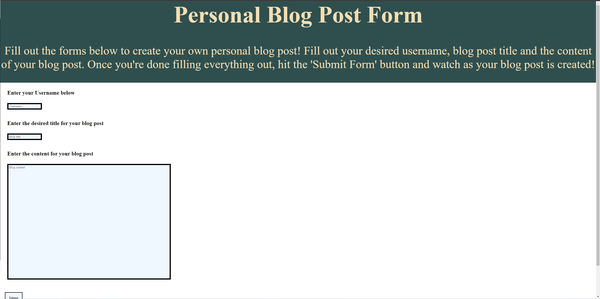
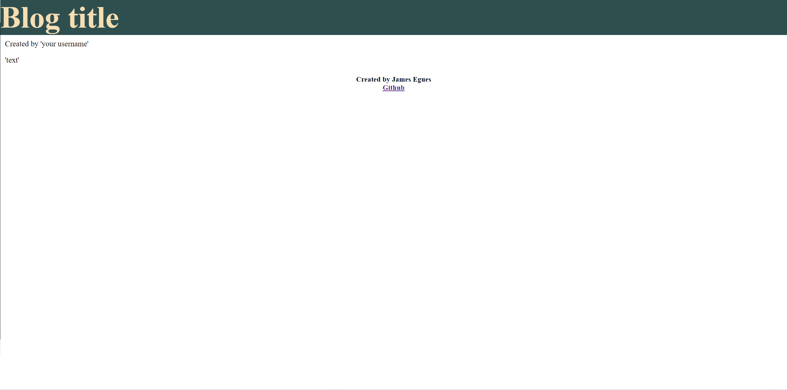

# Personal Blog

This site was created for my 4th challenge in the UNCC Coding Bootcamp. It is a site that provides users with a space to create personal blogs. The site is designed to take you to a separate page where you can create blog posts that will save to your local storage so that they do not disappear when you reload the page. This site was made in accordance with the following User Story and Acceptance Criteria.

## Link to github pages

https://jregues.github.io/personal-blog/

## User Story
```
AS A marketing student,
I WANT a personal blog
SO THAT I can showcase my thoughts and experiences.
```

## Acceptance Criteria

```
GIVEN a personal blog
WHEN I load the app,
THEN I am presented with the landing page containing a form with labels and inputs for username, blog title, and blog content.
WHEN I submit the form,
THEN blog post data is stored to localStorage.
WHEN the form submits,
THEN I am redirected to the posts page.
WHEN I enter try to submit a form without a username, title, or content,
THEN I am presented with a message that prompts me to complete the form.
WHEN I view the posts page,
THEN I am presented with a header, with a light mode/dark mode toggle, and a "Back" button.
WHEN I click the light mode/dark mode toggle,
THEN the page content's styles update to reflect the selection.
WHEN I click the "Back" button,
THEN I am redirected back to the landing page where I can input more blog entries.
WHEN I view the main content,
THEN I am presented with a list of blog posts that are pulled from localStorage.
WHEN I view localStorage,
THEN I am presented with a JSON array of blog post objects, each including the post author's username, title of the post, and post's content.
WHEN I take a closer look at a single blog entry in the list,
THEN I can see the title, the content, and the author of the post.
WHEN I view the footer,
THEN I am presented with a link to the developer's portfolio.
```

## How to use
Fill out the forms with your username, blog title, and the content for your blog post. Once you are happy with your blog content click on the submit button and the page will redirect to a page dedicated to your blog posts.

## Screenshots

